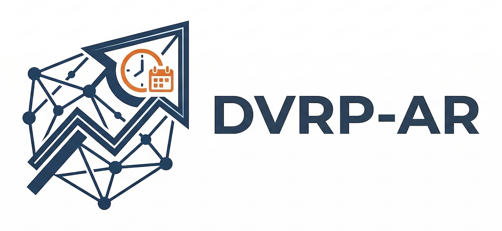
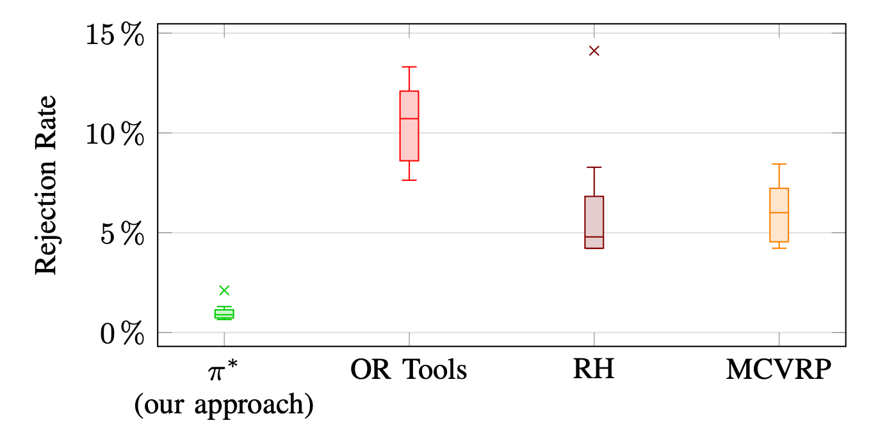

This repository contains the code and data for the paper “Dynamic Vehicle Routing Problem with Prompt Confirmation of Advance Requests”, published at the [17th ACM/IEEE International Conference on Cyber-Physical Systems (ICCPS 2026)](https://hscc.acm.org/2026/).

**arXiv version:** *coming soon*

# DVRP-AR: Dynamic Vehicle Routing Problem with Prompt Confirmation of Advance Requests

Transit agencies that operate on-demand transportation services have to respond to trip requests from passengers in real time, which involves solving *dynamic vehicle routing problems with pick-up and drop-off constraints*. Based on discussions with public transit agencies, we observe a real-world problem that is not addressed by prior work: when trips are booked in advance (e.g., trip requests arrive a few hours in advance of their requested pick-up times), the agency needs to *promptly confirm whether a request can be accepted or not*, and ensure that accepted requests are served as promised. State-of-the-art computational approaches either provide prompt confirmation but lack the ability to *continually optimize and improve routes for accepted requests*, or they provide continual optimization but cannot guarantee serving all accepted requests. To address this gap, we introduce a novel problem formulation of *dynamic vehicle routing with prompt confirmation and continual optimization*. We propose a novel computational approach for this vehicle routing problem, which integrates a quick insertion search for prompt confirmation with an anytime algorithm for continual optimization. To maximize the number requests served, we train a non-myopic objective function using reinforcement learning, which guides both the insertion and the anytime algorithms towards optimal, non-myopic solutions. We evaluate our computational approach on a real-world microtransit dataset from a public transit agency in the U.S., demonstrating that our proposed approach provides prompt confirmation while significantly increasing the number of requests served compared to existing approaches.

![Illustration of DVRP-AR: During service, (1) requests arrive following a known distribution (e.g., based on historical data); (2) upon the arrival of each request, we decide whether to accept or reject the request given the current state of the service; (3) we promptly notify the passenger of our decision; (4) until the next request arrives, we continuously optimize route plans to better accommodate future requests. Symbols $p_k$ and $d_k$ represent the pickup and dropoff of request $k$, respectively.](images/DVRP_AR_illustration.png)

During service, (1) requests arrive following a known distribution (e.g., based on historical data); (2) upon the arrival of each request, we decide whether to accept or reject the request given the current state of the service; (3) we promptly notify the passenger of our decision; (4) until the next request arrives, we continuously optimize route plans to better accommodate future requests. Symbols $p_k$ and $d_k$ represent the pickup and dropoff of request $k$, respectively.



Distribution of request rejection rates across five different episodes from the real-world microtransit data.


Distribution of request rejection rates across five different episodes from the NYC taxi data.


---------------------------------------------------------------------------------------------

### Setting up the Environment

---------------------------------------------------------------------------------------------

- Create a virtual environment using Conda:

```shell
conda create -n ovwab_env python=3.11
```

* Activate the environment:

```shell
conda activate ovwab_env
```

* Install the required libraries from ```requirements.txt``` file (configured with ```keras==3.6.0``` and ```torch==2.5.0```):

```shell
pip install -r requirements.txt --no-cache-dir
```

* Install ```graphviz``` using ```conda install graphviz``` to save the model images.
* The environment variable ```KERAS_BACKEND``` is configured at runtime by the scripts using ```importlib```.
* Make sure to install one of the ```KERAS_BACKEND``` before executing any of the following sample codes.
* To run MCVRP baseline (Wilbur et al. 2022),
please install ```julia``` (probably an ```LTS``` version) and install dependencies from ```baselines/mcvrp/julia_dependencies.jl``` (copy of https://github.com/smarttransit-ai/iccps-2022-paratransit-public/blob/main/bin/julia_packages.jl).

### Directory Description

---------------------------------------------------------------------------------------------

* ```baselines/mcvrp``` - Julia implementation of MCVRP baseline (Wilbur et al. 2022)
* ```baselines/rh``` - slightly modified code from original published code (https://github.com/MAS-Research/RollingHorizon) (Kim et al. 2023)
* ```common``` - common functions used in the codebase
* ```env``` - implementation of the environment that could be used in training and evaluation
* ```learn``` - implementation of the learning module
* ```model``` - implementation of generating feature vectors and neural network models

### Matrix Initialization

---------------------------------------------------------------------------------------------

```shell
python generate_matrix_and_processed_data.py
```
Please run the above script to generate the travel-time matrices (for different solvers) and another Python-byte object, which are required for efficient solving.

### Gathering Experiences

---------------------------------------------------------------------------------------------

```shell
python main.py --execution_mode gather-experience --objective rl-custom --insertion_approach exhaustive --data_dir ../data --data_id MTD --save_experiences
```
```data_id```: ```MTD``` for microtransit data, ```NYC``` for NYC taxi data, ```ABS``` for abstract problem instances.

### Offline Training

---------------------------------------------------------------------------------------------

```shell
python main.py --execution_mode offline-train --load_experiences --experience_dir sample_experiences --learning_rate 0.001 batch_size 1024 --model_arch mlp --model_config_version 0 --model_version 0 --use_gpu
python main.py --execution_mode offline-train --load_experiences --experience_dir sample_experiences --learning_rate 0.001 batch_size 1024 --model_arch kan --model_config_version 0 --model_version 0 --use_gpu
python main.py --execution_mode offline-train --load_experiences --experience_dir sample_experiences --learning_rate 0.001 batch_size 1024 --model_arch cnn --model_config_version 0 --model_version 0 --use_gpu
```

Note: ```KAN``` (```model_arch```:```kan```) is only supported in PyTorch while performing offline training; others can work with both TensorFlow and PyTorch backends.

* ```experience_dir```: absolute path or relative path with respect to ```code``` root;
                experiences directory should be organized as ```experience_dir/train``` (train experiences) and ```experience_dir/test``` (test experiences)
* ```learning_rate```: learning rate of the Adam optimizer
* ```batch_size```: batch size to be considered in ```model.fit()``` function
* ```model_arch```: model architectures ```mlp``` (Multi Layer Perceptron), ```kan``` (Kolmogorov–Arnold Network), and ```cnn``` (Convolutional Neural Network) 
* ```model_config_version```: 0 is valid for all three model architectures, 1 is valid for only ```mlp``` and ```cnn```
* ```model_version```: for ```mlp``` (```0-116```), for ```cnn``` (```0-71```) and for ```kan``` (```0-89```) (model architecture without a dropout)
* ```feature_code```: for ```mlp``` and ```kan```: (```cia```, ```cia-cac```, and ```cac```); for ```cnn```: (```cia``` only)
* ```look_ahead_window_size```: any value greater than 0, (ideal values: 30, 60, ...); values divide the look-ahead horizon to ```look_ahead_window_size``` (in seconds)
* ```look_ahead_grid_size```: any value greater than 0, (ideal values: 1, 2, 3); values divide the city into a ```look_ahead_grid_size``` by ```look_ahead_grid_size``` grid
* ```look_ahead_slot_count```: range indicating the number of consecutive slots to consider (i.e., from ```1``` - ```look_ahead_slot_count```)
* ```look_ahead_slot_step_size```: minimum slot size
* ```number_of_routes_to_consider```: up to how many routes we want to consider
* ```use_gpu```: if you want to use GPU, otherwise skip (default: use CPU)

### Evaluation

---------------------------------------------------------------------------------------------
Please refer to ```best_model_combo.csv``` for more details. While evaluating, please pass the correct parameters accordingly.
For example,
```
model_arch,model_dir,look_ahead_slot_count,look_ahead_slot_step_size,look_ahead_grid_size,number_of_routes_to_consider,feature_code,model_version
mlp,../model/MTD/MLP,1,2,1,1,cia-cac,48
```

In this case, add the following arguments to evaluate the scripts:
```
--model_arch mlp --model_dir ../model/MTD/MLP --look_ahead_slot_count 1 --look_ahead_slot_step_size 2 --look_ahead_grid_size 1 --number_of_routes_to_consider 1 --feature_code cia-cac --model_version 48
```

```sample_idx```: can take values 40, 41, 42, 43, 44

When evaluating using a trained model, restrict the input arguments (i.e., ```model_arch```, ```model_config_version```, ```model_version```, ```model_dir```) within these values.

1. Running our trained policy with the anytime algorithm:
    ```shell
    python main.py --execution_mode evaluation-best --objective rl-custom --search_objective rl-custom --insertion_approach exhaustive --search_approach sim_anneal --data_dir ../data --data_id MTD  --sample_idx 40 --perform_search --model_config_version 0 --model_arch mlp --model_dir ../model/MTD/MLP --look_ahead_slot_count 1 --look_ahead_slot_step_size 2 --look_ahead_grid_size 1 --number_of_routes_to_consider 1 --feature_code cia-cac --model_version 48
    ```

2. Running our trained policy with the anytime algorithm (but with maximizing idle time):
    ```shell
    python main.py --execution_mode evaluation-best --objective rl-custom --search_objective idle-time --insertion_approach exhaustive --search_approach sim_anneal --data_dir ../data --data_id MTD  --sample_idx 40 --perform_search --model_config_version 0 --model_arch mlp --model_dir ../model/MTD/MLP --look_ahead_slot_count 1 --look_ahead_slot_step_size 2 --look_ahead_grid_size 1 --number_of_routes_to_consider 1 --feature_code cia-cac --model_version 48
    ```

3. Running our trained policy with the anytime algorithm (with insertion controlled by maximizing idle time for selecting an insertion spot):
    ```shell
    python main.py --execution_mode evaluation-best --objective rl-custom --search_objective rl-custom --use_ve_only_at_decision --insertion_approach exhaustive --search_approach sim_anneal --data_dir ../data --data_id MTD  --sample_idx 40 --perform_search --model_config_version 0 --model_arch mlp --model_dir ../model/MTD/MLP --look_ahead_slot_count 1 --look_ahead_slot_step_size 2 --look_ahead_grid_size 1 --number_of_routes_to_consider 1 --feature_code cia-cac --model_version 48
    ```

4. Running our trained policy with the anytime algorithm (with fixed search duration between request arrivals):
    ```shell
    python main.py  --execution_mode evaluation-best --objective rl-custom --search_objective rl-custom --insertion_approach exhaustive --search_approach sim_anneal --data_dir ../data --data_id MTD  --sample_idx 40 --perform_search --fixed_search --fixed_search_duration 10 --model_config_version 0 --model_arch mlp --model_dir ../model/MTD/MLP --model_config_version 0 --model_arch mlp --look_ahead_slot_count 1 --look_ahead_slot_step_size 2 --look_ahead_grid_size 1 --number_of_routes_to_consider 1 --feature_code cia-cac --model_version 48
    ```

5. Running our trained policy without the anytime algorithm:
    ```shell
    python main.py --execution_mode evaluation-best --objective rl-custom --search_objective rl-custom --insertion_approach exhaustive --search_approach sim_anneal --data_dir ../data/MTD --data_id MTD --sample_idx 40 --model_config_version 0 --model_arch mlp --model_dir ../model/MTD/MLP --look_ahead_slot_count 1 --look_ahead_slot_step_size 2 --look_ahead_grid_size 1 --number_of_routes_to_consider 1 --feature_code cia-cac --model_version 48
    ```

6. Running our simple policy with the anytime algorithm:
    ```shell
    python main.py --execution_mode evaluation --objective idle-time --search_objective idle-time --insertion_approach exhaustive --search_approach sim_anneal --data_dir ../data --data_id MTD  --sample_idx 40 --perform_search
    ```

7. Running our simple policy with the anytime algorithm (with fixed search duration between request arrivals):
    ```shell
    python main.py --execution_mode evaluation --objective idle-time --search_objective idle-time --insertion_approach exhaustive --search_approach sim_anneal --data_dir ../data --data_id MTD  --sample_idx 40 --perform_search --fixed_search --fixed_search_duration 10
    ```

8. Running our simple policy without the anytime algorithm:
    ```shell
    python main.py --execution_mode evaluation --objective idle-time --search_objective idle-time --insertion_approach exhaustive --search_approach sim_anneal --data_dir ../data --data_id MTD --sample_idx 40
    ```

9. Running Google OR-Tools with the anytime algorithm:
    ```shell
    python main.py --execution_mode evaluation --objective idle-time --search_objective idle-time --insertion_approach routing --search_approach routing --data_dir ../data --data_id MTD  --sample_idx 40 --perform_search
    ```

10. Running Google OR-Tools without the anytime algorithm:
    ```shell
    python main.py --execution_mode evaluation --objective idle-time --search_objective idle-time --insertion_approach routing --search_approach routing --data_dir ../data --data_id MTD --sample_idx 40
    ```

11. Running Rolling Horizon baseline (Kim et al. 2023):
    1. Before executing, create an empty conda environment called ```python_update```.
    2. Code is based on ```MOSEK``` (license is required to run experiments).

    M-series MacBook:
    ```shell
    python main.py --execution_mode evaluation --insertion_approach rolling-horizon --data_dir ../data --data_id MTD --sample_idx 40 --rtv_rh 1 --rtv_interval 60 --rtv_time_limit 1 --rtv_bin_name rolling_horizon_m1
    ```
    Linux:
    ```shell
    python main.py --execution_mode evaluation --insertion_approach rolling-horizon --data_dir ../data --data_id MTD --sample_idx 40 --rtv_rh 1 --rtv_interval 60 --rtv_time_limit 1 --rtv_bin_name rolling_horizon_linux
    ```
    * ```rtv_rh```: value of the rolling horizon factor
    * ```rtv_interval```: time period to consider the set of requests as a single batch
    * ```rtv_time_limit```: number of seconds that the RTV graph generator can spend on each vehicle
    * ```rtv_bin_name```: for M1 choose, ```rolling_horizon_m1```, for Linux choose, ```rolling_horizon_linux```

12. Running MC-VRP baseline (Wilbur et al. 2022):

    **MTD dataset**
    ```shell
    julia baselines/mcvrp/iccps_baseline_MTD.jl 1 5 25 1.0 
    ```
    * The first argument indicates the start index of the test set (please choose values from 1 to 5).
    * The second argument indicates the end index of the test set (please choose values from 1 to 5).
    * The third argument indicates the number of train chains (please choose values from 1 to 25).
    * The fourth argument indicates compute time between at each decision epoch (please choose values from starting from 1.0).

    **NYC dataset**
    ```shell
    julia baselines/mcvrp/iccps_baseline_NYC.jl 1 5 25 1.0 
    ```
    * The first argument indicates the start index of the test set (please choose values from 1 to 5).
    * The second argument indicates the end index of the test set (please choose values from 1 to 5).
    * The third argument indicates the number of train chains (please choose values from 1 to 25).
    * The fourth argument indicates compute time between at each decision epoch (please choose values from starting from 1.0).

### References

-----------
1. Kim, Y., Edirimanna, D., Wilbur, M., Pugliese, P., Laszka, A., Dubey, A., & Samaranayake, S. (2023). Rolling horizon based temporal decomposition for the offline pickup and delivery problem with time windows. In Proceedings of the 37th AAAI Conference on Artificial Intelligence (AAAI 2023).
2. Wilbur, M., Kadir, S. U., Kim, Y., Pettet, G., Mukhopadhyay, A., Pugliese, P., Samaranayake, S., Laszka, A. and Dubey, A. (2022). An online approach to solve the dynamic vehicle routing problem with stochastic trip requests for paratransit services. In Proceedings of the 15th ACM/IEEE International Conference on Cyber-Physical Systems (ICCPS 2024).
